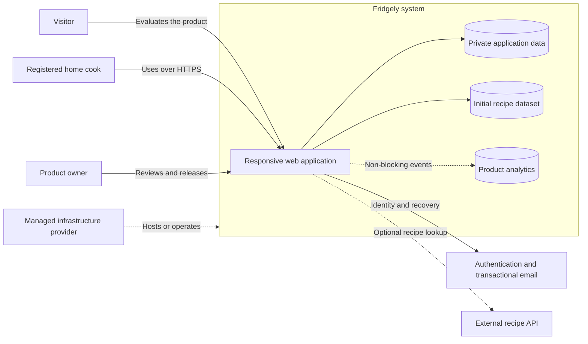

# Fridgely system context and quality baseline

This document is the review candidate for [Architecture Issue #50](https://github.com/YassineMessioui/Fridgely/issues/50). It describes the environment and measurable expectations that future architecture decisions must satisfy. It deliberately does not select frameworks, databases, hosting providers, or other vendors.

The document becomes the accepted baseline when its pull request is reviewed and merged. Later changes should explain which assumption changed and link the relevant issue or Architecture Decision Record (ADR).

## Product intent

Fridgely is a public portfolio project and a working web MVP for a small invited audience. It must demonstrate a stable core user journey while creating opportunities to compare unfamiliar technologies and learn system-design techniques.

The initial product is a mobile-first responsive web application. A home cook can maintain private food inventory, discover recipes, record cooking deductions, and manage a shopping list. Desktop browsers remain supported, but mobile inventory entry is the primary interaction target.

## System context

The diagram identifies responsibilities and relationships, not vendors or deployment units. A managed service can be outside the codebase while Fridgely remains responsible for correct authorization, privacy, retention, failure handling, and cost.

### Actors

| Actor | Responsibility and expectation |
| --- | --- |
| Visitor | Views the public product and can reach registration or sign-in |
| Registered home cook | Manages private account, inventory, recipes, cooking activity, and shopping data from one or more devices |
| Product owner | Reviews architecture and pull requests, accepts releases, and controls product scope |

### Fridgely responsibilities

- Responsive browser experience and application behavior
- Per-user authorization and private application data
- Inventory, cooking, shopping, preference, and favorite-recipe rules
- Initial recipe data owned or normalized by Fridgely
- Product analytics that cannot block core behavior
- Account and personal-data deletion semantics
- Graceful behavior when optional external capabilities are unavailable

### Potential external dependencies

- Managed hosting or application platform
- Managed persistent data storage
- Authentication and essential transactional email
- Optional low-cost recipe API

Authentication, recipe, data, and infrastructure vendors remain undecided and must be evaluated in their relevant architecture or feature issues.

## Confirmed constraints

### Hard constraints

- Deliver a responsive web MVP; native applications are outside the initial scope.
- Support the latest stated versions of Chrome, Safari, Firefox, and Edge.
- Treat mobile as the primary interaction target while keeping desktop flows usable.
- Serve a globally oriented audience without requiring multi-region deployment for the MVP.
- Support at least 100 registered accounts and approximately 10 simultaneously active users under normal MVP behavior.
- Use HTTPS for production traffic.
- Keep one user's private data inaccessible to other users.
- Do not normally lose an inventory change after the system confirms it.
- Make inventory and shopping functionality usable when recipe or analytics functionality is unavailable.
- Remove account access and primary personal data immediately after confirmed deletion.
- Remove residual backup copies within 30 days of account deletion.
- Permit essential authentication email for verification and password recovery; general product email is outside the MVP.
- Use local development, staging after merge, and manually approved production releases.
- Keep real-time synchronization and offline operation outside the MVP.

### Soft constraints

- Prefer free service tiers; keep justified normal operating costs within approximately €10–€30 per month.
- Prefer managed services when they reduce undifferentiated operational work.
- Accept limited vendor dependence when it materially simplifies the MVP and the dependency is documented.
- Introduce containers when they provide concrete learning, reproducibility, or deployment value.
- Explore unfamiliar technologies, but keep each selection explainable and bounded by the feature being developed.
- Prefer the fewest interactions for common inventory entry; advanced fields may be progressively disclosed.

## Quality-attribute scenarios

These scenarios convert broad goals such as “fast” and “stable” into reviewable targets. Measurement tooling is selected later, but an architecture option must explain how it can meet each target.

| ID | Attribute | Scenario | Measure |
| --- | --- | --- | --- |
| QA-01 | Page performance | A signed-in user opens a main page on a supported browser over good consumer Wi-Fi while approximately 10 users are active | Primary page content is usable within two seconds at the 95th percentile during the agreed test |
| QA-02 | Task usability | A representative user manually adds a common inventory item using the mobile layout | The user completes the action in under ten seconds without assistance |
| QA-03 | Capacity | The system stores at least 100 accounts while approximately 10 users perform normal inventory and dashboard actions concurrently | Core requests complete without known blocking errors and remain within the applicable response targets |
| QA-04 | Data reliability | The application confirms an inventory create, edit, consume, or delete operation | A reload shows the confirmed state; acceptance and failure-injection checks produce no acknowledged-but-missing updates |
| QA-05 | Dependency isolation | Recipe lookup or analytics collection is unavailable | Inventory and shopping actions continue; affected recipe behavior reports a clear degraded state; analytics failure is not shown as a product failure |
| QA-06 | Account deletion | An authenticated user confirms account deletion | Access is revoked and primary personal data is removed immediately; residual backup copies expire within 30 days |
| QA-07 | Operating cost | The MVP runs under its normal small-audience workload for a billing month | Expected recurring service cost remains within €10–€30, with free tiers preferred and material cost drivers documented |
| QA-08 | Accessibility baseline | A user completes a core flow using keyboard navigation or assistive semantics | Controls have programmatic labels, focus is visible, order is usable, contrast is readable, and validation is not conveyed by color alone |
| QA-09 | Release control | A pull request is merged and later selected for release | The merged revision reaches staging first; production deployment occurs only after an explicit manual release action |

No commercial availability percentage or formal WCAG certification is promised for the MVP. Those commitments require additional measurement, operational processes, and scope.

## Assumptions to validate

- A single deployment region provides acceptable latency for the initial global audience.
- Good consumer Wi-Fi is an appropriate initial reference connection for the two-second page target.
- Approximately 10 simultaneously active users represents realistic early load.
- A small Fridgely-managed recipe dataset may be sufficient before integrating an external recipe API.
- Refresh-based cross-device consistency is acceptable to early users.
- Product analytics can be stored by Fridgely without creating unacceptable coupling, cost, privacy risk, or query load.
- Suitable managed providers can implement the immediate primary-data deletion and 30-day backup-retention expectation.

An assumption is not an accepted implementation decision. It must be tested when it begins to influence a technology selection or feature design.

## Deferred capabilities

- Real-time multi-device synchronization
- Offline operation
- Barcode, QR-code, receipt, or photograph scanning
- Searchable external food catalog
- Native mobile applications
- Search-engine optimization as a delivery priority
- Formal accessibility certification
- Multi-region deployment
- Commercial-scale availability or capacity guarantees

Deferred capabilities remain visible so that avoidable dead ends can be recognized, but they do not justify building their infrastructure during the MVP.

## Architectural consequences

Future options should be rejected or challenged when they:

- Cannot isolate inventory and shopping behavior from optional recipe or analytics failures.
- Require costs outside the agreed range without a reviewed justification.
- Make mobile inventory entry unnecessarily slow or complex.
- Prevent per-user authorization or the agreed deletion behavior.
- Require real-time, offline, multi-region, or commercial-scale infrastructure to deliver the first vertical slice.
- Hide operational responsibilities behind a managed-service label.

Architecture comparisons should explicitly show how each viable option supports this baseline, what it makes harder, and how reversible the decision remains.

## Traceability

- [Epic #1: Fridgely Web MVP](https://github.com/YassineMessioui/Fridgely/issues/1)
- [Epic #49: Architecture Foundation](https://github.com/YassineMessioui/Fridgely/issues/49)
- [Issue #50: System context, constraints, and quality attributes](https://github.com/YassineMessioui/Fridgely/issues/50)
- [Issue #12: Email registration and sign-in](https://github.com/YassineMessioui/Fridgely/issues/12)
- [Issue #19: Recipe data source](https://github.com/YassineMessioui/Fridgely/issues/19)
- [Issue #38: Responsive and cross-browser experience](https://github.com/YassineMessioui/Fridgely/issues/38)
- [Issue #40: Web performance budgets](https://github.com/YassineMessioui/Fridgely/issues/40)
- [Issue #42: HTTPS and personal-data security](https://github.com/YassineMessioui/Fridgely/issues/42)
- [Issue #44: Analytics contract and privacy boundaries](https://github.com/YassineMessioui/Fridgely/issues/44)
- [Issue #46: Manual MVP acceptance validation](https://github.com/YassineMessioui/Fridgely/issues/46)
